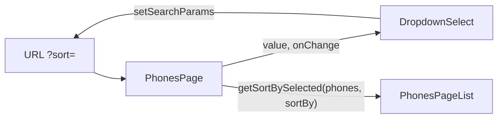

# Сортировка каталога через URL Search Params

URL — единственный источник правды для режима сортировки. `DropdownSelect` только отображает текущее значение и сообщает родителю о выборе.

## 1. DropdownSelect — контролируемый UI

Файлы: [`src/shared/components/DropdownSelect/DropdownSelect.tsx`](src/shared/components/DropdownSelect/DropdownSelect.tsx), [`DropdownSelect.scss`](src/shared/components/DropdownSelect/DropdownSelect.scss).

Пропсы (строгая типизация):

- `label: string`
- `value: string`
- `onChange: (value: string) => void`
- `options: { value: string; label: string }[]`

Тип опции можно держать рядом с компонентом или в [`src/shared/types/SortSelect.ts`](src/shared/types/SortSelect.ts) (уже есть `SORT_BY` / `SortBy`).

JSX (кастомный список, не native `<select>`):

- корневой блок с `ref` (для click outside);
- заголовок `label` (например «Sort by»);
- кнопка-триггер с подписью выбранной опции (`options.find(...).label`; если `value` нет в списке — показать первую опцию);
- список опций, видимый при `isOpen`.

Локальное состояние: `isOpen`. Клик по триггеру тоглит список. Выбор опции вызывает `onChange` и закрывает список. Закрытие по клику вне: `useEffect` + `mousedown`/`pointerdown` на `document`, проверка `rootRef.current.contains(target)`. Cleanup listener при unmount.

Стили (BEM `dropdown-select`, импорт `@/styles/utils`): корневой flex-column, базовая ширина (около 176px — типичная ширина Sort by в макете Nice Gadgets), высота триггера ~40px, текст через `%small-text` / `%body-text`, список `position: absolute` и `z-index: z('dropdown')`. Без inline-стилей. `min-width: 0` на flex-детях.

По правилу проекта — скелетон той же геометрии: `DropdownSelectSkeleton` (показывать на `PhonesPage` при `isLoading`).

## 2. PhonesPage — чтение URL и сортировка

Файл: [`src/modules/PhonesPage/PhonesPage.tsx`](src/modules/PhonesPage/PhonesPage.tsx).

- `const [searchParams, setSearchParams] = useSearchParams()`.
- Ключ query: `sort`. Значение валидировать по `SORT_BY` (`age` | `title` | `price`); иначе дефолт `SORT_BY.AGE` (`'age'`).
- Отфильтрованные телефоны прогонять через [`src/utils/getSortBySelected.ts`](src/utils/getSortBySelected.ts) (`age` → новые сначала по `year`, `price` → дешевле, `title` → `name`).
- Отсортированный массив отдать в существующий [`PhonesPageList`](src/modules/PhonesPage/components/PhonesPageList/PhonesPageList.tsx).
- Экспорт утилиты из [`src/utils/index.ts`](src/utils/index.ts) (`export * from './getSortBySelected'`), чтобы импортировать как остальные utils.

`DropdownSelect` между `CatalogHeader` и списком:

- `label="Sort by"`
- `value={sortBy}` из URL
- `options`: Newest / Alphabetically / Cheapest, `value` = `SORT_BY.AGE` / `TITLE` / `PRICE`
- `onChange`: клонировать текущие `searchParams`, `set('sort', nextValue)`, `setSearchParams` — остальные query не затирать

В [`PhonesPage.scss`](src/modules/PhonesPage/PhonesPage.scss) — ряд контролов над сеткой (отступ, `min-width: 0`).

## 3. Что не трогать

[`src/utils/sortProducts.ts`](src/utils/sortProducts.ts) — старые хелперы для слайдеров HomePage (`sortByYear`, hot prices). Сортировка каталога идёт только через `getSortBySelected`.

## 4. Проверка

На `/phones`: смена опции обновляет `?sort=...`, порядок карточек меняется, F5 сохраняет выбор, клик вне закрывает список, невалидный `?sort=foo` ведёт себя как `age`. Mobile-first 320px — селект не раздувает layout.
